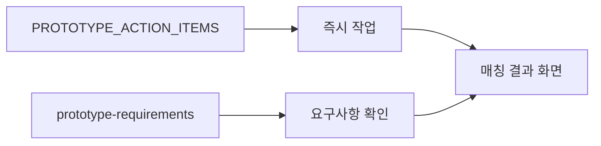

# 프론트엔드 문서 가이드

> GO ALMOND 프론트엔드 개발 관련 모든 문서를 여기에서 확인할 수 있습니다.

---

## 🚀 빠른 시작

### 지금 무엇을 해야 하나요?

#### 프로토타입 개발 중이라면
👉 **[PROTOTYPE_ACTION_ITEMS.md](./PROTOTYPE_ACTION_ITEMS.md)** - 즉시 실행 가능한 액션 아이템

#### 전체 요구사항을 확인하려면
👉 **[prototype-requirements-2026-02-03.md](./prototype-requirements-2026-02-03.md)** - 2026-02-03 회의 기반 프로토타입 요구사항

#### MVP 개발 계획이 필요하다면
👉 **[frontend-mvp-plan.md](./frontend-mvp-plan.md)** - MVP 2.5주 개발 계획

---

## 📚 문서 목록

### 1. 개발 계획 문서

#### 🔴 최우선 (프로토타입)
- **[prototype-requirements-2026-02-03.md](./prototype-requirements-2026-02-03.md)**
  - 2026-02-03 회의록 기반 프로토타입 요구사항
  - UI/UX 우선순위, 기술 결정사항, 액션 아이템
  - 투자자 데모 준비 가이드
  - **작성일**: 2026-02-04

- **[PROTOTYPE_ACTION_ITEMS.md](./PROTOTYPE_ACTION_ITEMS.md)**
  - 각 담당자별 즉시 실행 가능한 액션 아이템
  - 우선순위별 정리 및 진행 상황 추적
  - 마일스톤 및 블로킹 이슈
  - **작성일**: 2026-02-04

- **[matching-result-design-spec.md](./matching-result-design-spec.md)**
  - 매칭 결과 화면 디자인 명세 (레퍼런스 이미지 기반)
  - 화면 구조 6개 섹션 상세, 컴포넌트 명세, Gap 분석, 구현 로드맵
  - **작성일**: 2026-02-04

- **[backend-data-requirements.md](./backend-data-requirements.md)**
  - 매칭 결과 리포트용 백엔드 데이터 확장 요구사항
  - 프론트 정적/더미 필드의 실제 데이터 전환 가이드
  - **작성일**: 2026-02-04

#### 🟡 MVP 계획 (2.5주)
- **[frontend-mvp-plan.md](./frontend-mvp-plan.md)**
  - MVP 핵심 기능 중심 2.5주 계획 (60시간)
  - Epic별 상세 작업 내용
  - 백엔드 협업 체크리스트
  - **작성일**: 2026-01-26
  - **수정일**: 2026-02-04 (프로토타입 요구사항 반영)

#### 🟢 전체 계획 (13주)
- **[frontend-workplan.md](./frontend-workplan.md)**
  - 전체 기능 개발 13주 계획 (308시간)
  - Phase별 상세 작업 내용
  - 기술 스택 및 리스크 분석
  - **작성일**: 2026-01-26
  - **수정일**: 2026-02-04

### 2. 이슈 관리
- **[JIRA_ISSUES.md](./JIRA_ISSUES.md)**
  - 프론트엔드 개발 이슈 목록
  - 버그 추적 및 개선 사항

### 3. 계획 비교
- **[PLAN_COMPARISON.md](./PLAN_COMPARISON.md)**
  - MVP 계획 vs 전체 계획 비교
  - 단계별 우선순위 분석

---

## 🗂️ 문서 구조

```
docs/frontend/
├── README.md                              # 📍 현재 문서 (가이드)
├── prototype-requirements-2026-02-03.md   # 🔴 프로토타입 요구사항
├── PROTOTYPE_ACTION_ITEMS.md              # 🔴 액션 아이템 요약
├── matching-result-design-spec.md         # 🔴 매칭 결과 화면 디자인 명세
├── backend-data-requirements.md           # 🔴 백엔드 데이터 요구사항
├── frontend-mvp-plan.md                   # 🟡 MVP 2.5주 계획
├── frontend-workplan.md                   # 🟢 전체 13주 계획
├── JIRA_ISSUES.md                         # 이슈 추적
└── PLAN_COMPARISON.md                     # 계획 비교
```

---

## 🎯 문서 선택 가이드

### 상황별 추천 문서

| 상황 | 추천 문서 | 이유 |
|------|----------|------|
| 지금 당장 무엇을 해야 하는지 모를 때 | [PROTOTYPE_ACTION_ITEMS.md](./PROTOTYPE_ACTION_ITEMS.md) | 담당자별 즉시 실행 가능한 작업 목록 |
| 프로토타입 전체 요구사항 확인 | [prototype-requirements-2026-02-03.md](./prototype-requirements-2026-02-03.md) | 회의록 기반 상세 요구사항 |
| 매칭 결과 화면 디자인/구현 | [matching-result-design-spec.md](./matching-result-design-spec.md) | 화면 구성, Gap 분석, 로드맵 |
| 백엔드 데이터 확장 필요 시 | [backend-data-requirements.md](./backend-data-requirements.md) | 리포트용 데이터 요구사항 |
| MVP 개발 일정 확인 | [frontend-mvp-plan.md](./frontend-mvp-plan.md) | 2.5주 Epic별 작업 계획 |
| 전체 프로젝트 범위 확인 | [frontend-workplan.md](./frontend-workplan.md) | 13주 전체 기능 계획 |
| 이슈 추적 및 버그 확인 | [JIRA_ISSUES.md](./JIRA_ISSUES.md) | 개발 이슈 목록 |

### 역할별 추천 문서

#### 프론트엔드 개발자 (JI UN HONG)
1. 🔴 [PROTOTYPE_ACTION_ITEMS.md](./PROTOTYPE_ACTION_ITEMS.md) - 즉시 작업 항목
2. 🔴 [prototype-requirements-2026-02-03.md](./prototype-requirements-2026-02-03.md) - UI/UX 요구사항
3. 🔴 [matching-result-design-spec.md](./matching-result-design-spec.md) - 매칭 결과 화면 디자인 명세
4. 🟡 [frontend-mvp-plan.md](./frontend-mvp-plan.md) - Epic별 작업 계획

#### 백엔드 개발자 (Patrick Park)
1. 🔴 [PROTOTYPE_ACTION_ITEMS.md](./PROTOTYPE_ACTION_ITEMS.md) - API 완성 항목
2. 🔴 [prototype-requirements-2026-02-03.md](./prototype-requirements-2026-02-03.md) - 기술적 결정사항
3. 🔴 [backend-data-requirements.md](./backend-data-requirements.md) - 리포트 데이터 확장

#### 프로젝트 매니저 (JOO LIM)
1. 🔴 [PROTOTYPE_ACTION_ITEMS.md](./PROTOTYPE_ACTION_ITEMS.md) - 전체 진행 상황
2. 🔴 [prototype-requirements-2026-02-03.md](./prototype-requirements-2026-02-03.md) - 비즈니스 포커스
3. 🟡 [frontend-mvp-plan.md](./frontend-mvp-plan.md) - 전체 일정

#### 아키텍트 (Tim App)
1. 🔴 [prototype-requirements-2026-02-03.md](./prototype-requirements-2026-02-03.md) - 기술 전략
2. 🟢 [frontend-workplan.md](./frontend-workplan.md) - 기술 스택 및 리스크

---

## 📊 개발 단계별 문서 활용

### Phase 1: 프로토타입 (현재)
**목표**: 투자자 데모 준비



**주요 문서**:
- [PROTOTYPE_ACTION_ITEMS.md](./PROTOTYPE_ACTION_ITEMS.md)
- [prototype-requirements-2026-02-03.md](./prototype-requirements-2026-02-03.md)

---

### Phase 2: MVP 개발
**목표**: 핵심 기능 완성

**주요 문서**:
- [frontend-mvp-plan.md](./frontend-mvp-plan.md)
- [JIRA_ISSUES.md](./JIRA_ISSUES.md)

---

### Phase 3: 전체 기능 개발
**목표**: 정식 서비스 준비

**주요 문서**:
- [frontend-workplan.md](./frontend-workplan.md)
- [PLAN_COMPARISON.md](./PLAN_COMPARISON.md)

---

## 🔗 관련 문서

### 상위 폴더 문서
- [`docs/00_DEVELOPMENT_POLICY.md`](../00_DEVELOPMENT_POLICY.md) - 개발 정책 및 커밋 규칙
- [`docs/01_SECURITY_MANIFEST.md`](../01_SECURITY_MANIFEST.md) - 보안 가이드라인
- [`docs/02_ARCHITECTURE_INTEGRATION.md`](../02_ARCHITECTURE_INTEGRATION.md) - 시스템 아키텍처
- [`docs/03_DATA_DEFINITION.md`](../03_DATA_DEFINITION.md) - 데이터 명세
- [`docs/04_BACKEND_COOPERATION.md`](../04_BACKEND_COOPERATION.md) - 백엔드 협업 규격
- [`docs/ui-components.md`](../ui-components.md) - UI 컴포넌트 가이드

### 프로젝트 루트
- [`README.md`](../../README.md) - 프로젝트 전체 개요
- [`.cursorrules`](../../.cursorrules) - AI 개발 가이드

---

## 📝 문서 업데이트 가이드

### 새로운 문서 추가 시
1. 이 README에 링크 추가
2. 적절한 카테고리로 분류
3. 작성일 및 목적 명시
4. 관련 문서와의 연계성 표시

### 기존 문서 수정 시
1. 문서 하단 "변경 이력" 섹션 업데이트
2. 최종 수정일 업데이트
3. 주요 변경사항 간략히 기록

---

## ❓ FAQ

### Q1: 프로토타입 개발을 시작하려면 어떤 문서를 먼저 봐야 하나요?
**A**: [PROTOTYPE_ACTION_ITEMS.md](./PROTOTYPE_ACTION_ITEMS.md)부터 보세요. 담당자별 즉시 실행 가능한 작업이 정리되어 있습니다.

### Q2: MVP 계획과 프로토타입 요구사항의 차이는 무엇인가요?
**A**: 
- **프로토타입**: 투자자 데모용, 핵심 플로우만, 결과 화면 최우선
- **MVP**: 정식 서비스 준비, 2.5주 전체 기능

[PLAN_COMPARISON.md](./PLAN_COMPARISON.md)에서 상세 비교를 확인하세요.

### Q3: 백엔드와 협업할 때 어떤 문서를 참고하나요?
**A**: 
- [prototype-requirements-2026-02-03.md](./prototype-requirements-2026-02-03.md) - 기술적 결정사항
- [frontend-mvp-plan.md](./frontend-mvp-plan.md) - 백엔드 협업 체크리스트

### Q4: UI 컴포넌트는 어떻게 만들어야 하나요?
**A**: [`docs/ui-components.md`](../ui-components.md)의 Base 컴포넌트와 디자인 토큰을 참고하세요.

---

## 📞 문의

문서 관련 문의사항이나 개선 제안은 팀 채널 또는 JIRA 이슈로 등록해주세요.

---

**최종 업데이트**: 2026-02-04  
**관리자**: 프론트엔드 팀
